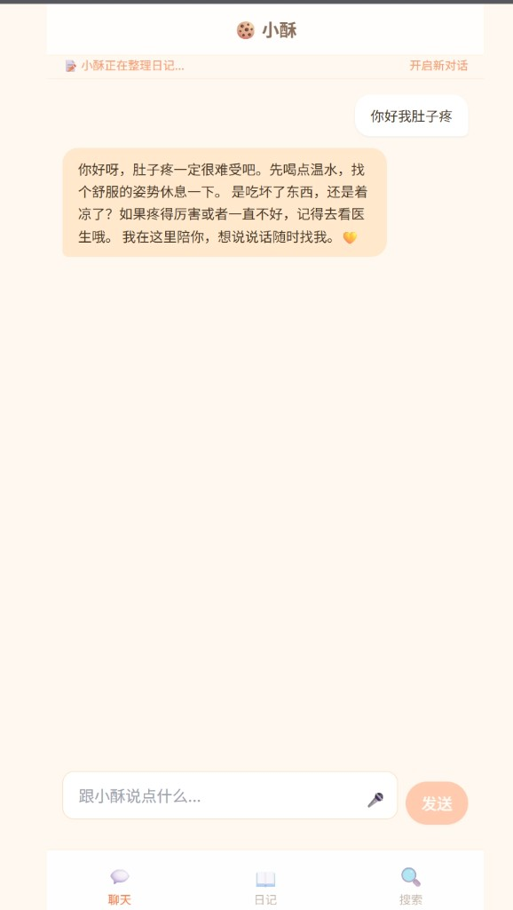

<div align="center">

# 🍪 小酥 AI 日记

**和 AI 聊聊天，日记就写好了。**

一个温暖的本地 AI 日记应用——跟小酥说说今天的事，她帮你整理成日记，全程离线存储、隐私安全。

[](LICENSE)
[](web/)
[](android/)

</div>

---

<div align="center">



</div>

---

## ⚡ 30 秒跑起来

### Web 端

```bash
cd web
cp .env.example .env          # 填入你的 Kimi API Key
npm install
npm run dev                   # → http://localhost:3000
```

### Android 端

```bash
cd android
flutter pub get
flutter build apk --release   # 输出在 build/app/outputs/flutter-apk/
```

安装后在「设置」页输入你的 Kimi API Key 即可使用。

---

## ✨ 核心亮点

| 功能 | 说明 |
|------|------|
| 🗣️ 聊天即日记 | 和小酥聊天，自动提取你说的内容整理成日记 |
| 📝 多轮合并 | 一天聊多次？自动按时间线合并到同一篇日记 |
| ✍️ 手动编辑 | 跳过 AI，直接写日记，支持语音输入 |
| 🔍 关键词搜索 | 搜索内容高亮匹配，快速翻阅过去的记录 |
| 🔒 本地存储 | Web 用 IndexedDB，Android 用 SQLite，数据不上云 |
| 🎨 暖心界面 | 奶茶色系，圆润设计，看着就舒服 |
| 🤖 朴实记录 | 不添油加醋，保留你自己的语言风格 |

---

## 🎯 为什么用小酥？

| 传统日记 App | 小酥 |
|---|---|
| 得自己想着写 | 聊着聊着就写好了 |
| 格式死板 | AI 自动整理、自动合并 |
| 数据传云端 | 纯本地，隐私放心 |
| 冰冷工具感 | 像朋友一样陪你聊 |

---

## 🛠️ 技术栈

| 平台 | 技术 |
|------|------|
| Web | React 18 + TypeScript + Vite 5 + TailwindCSS |
| Android | Flutter 3 + Dart + SQLite |
| AI | Kimi API (Moonshot AI)，兼容 OpenAI 格式 |
| 存储 | Web: IndexedDB / Android: SQLite |

---

## 📖 项目结构

```
xiaosu-ai-journal/
├── web/                # Web 版（React + Vite）
│   ├── src/
│   │   ├── pages/      # 聊天、日记列表、编辑、搜索
│   │   ├── services/   # AI 服务、本地存储
│   │   └── ...
│   └── .env.example
├── android/            # Android 版（Flutter）
│   ├── lib/
│   │   ├── screens/    # 聊天、日记、搜索、设置
│   │   ├── services/   # AI、数据库、事件通知
│   │   └── models/
│   └── pubspec.yaml
└── docs/screenshots/
```

---

## 🤝 Contributing

欢迎 PR 和 Issue！

1. Fork 本仓库
2. 创建你的分支 (`git checkout -b feat/your-feature`)
3. 提交修改 (`git commit -m 'feat: add something'`)
4. Push (`git push origin feat/your-feature`)
5. 发起 Pull Request

---

## 📄 License

[MIT](LICENSE) — 随便用，开心就好。
